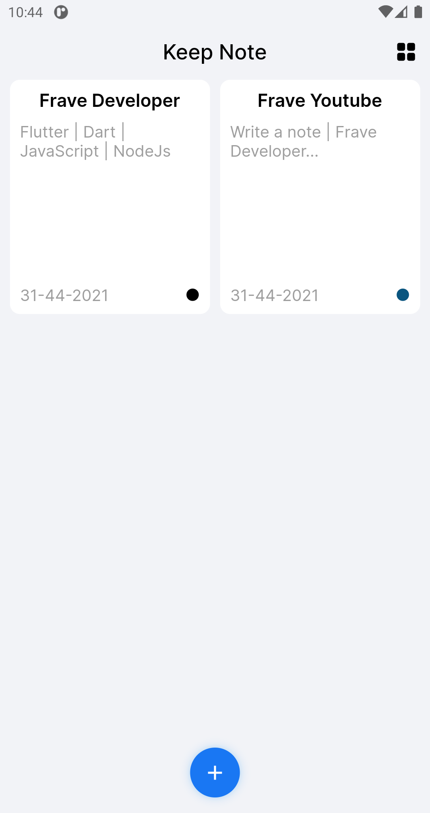

# KEEP NOTES - FLUTTER

## Hive NoSql - Flutter Bloc 

### Yotube Channel
[Frave Developer](https://www.youtube.com/channel/UCkNYlmbx487MPmYvfSMAdRg)

### Video Yotube
[Flutter - Keep Notes](https://www.youtube.com/watch?v=pPCfF87fsTU&t=72s&ab_channel=FraveDeveloper)

### Social Media

### Donate

___

## Screenshot

<table border>
    <tr>
        <td></td>
        <td></td>
        <td></td>
    <tr>
</table>